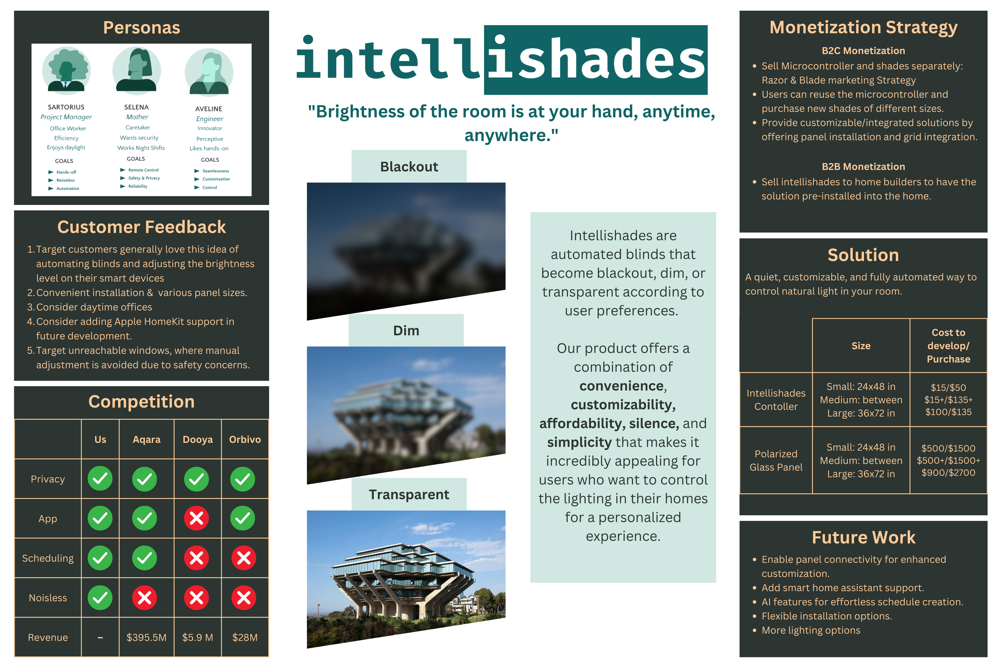
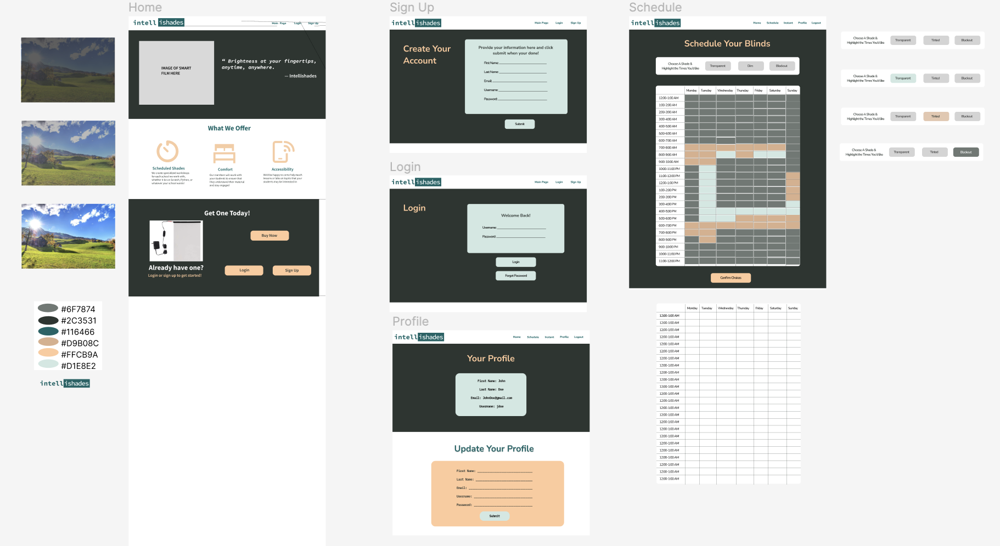
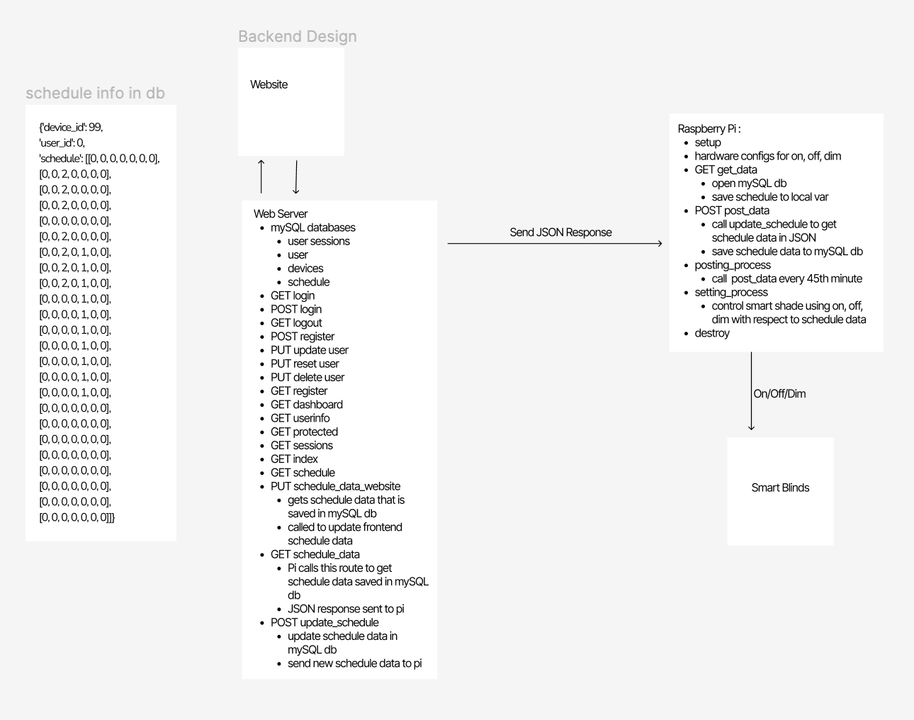
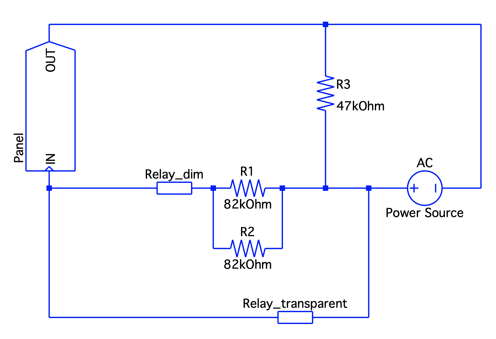

# Intellishades

Intellishades are automated blinds that become blackout, dim, or transparent according to user preferences. 

Our product offers a combination of convenience, customizability, affordability, silence, and simplicity that makes it incredibly appealing for users who want to control the lighting in their homes for a personalized experience.



# Demonstration of Working Product:
Changes in user input result in modifications that impact hardware: [video](https://drive.google.com/file/d/1jP9Ay9A8of-ToYy399PnNQbcbN-v1fzh/view?usp=sharing)

Shades Working as Expected: [video](https://drive.google.com/file/d/1DbfkBHqg82OO4WfUq4hHNVDEtI_BUvC3/view?usp=sharing)

# Usage:
Must have all required dependencies installed before running. 

To initialize database:
```
mysql -u <mysql_username> -p < init_db.sql
```

To start the server (in /code directory):
```
python server.py
```

# Frontend Design:
[Figma](https://www.figma.com/file/CwTfonK6t4CYgE0CZVU4aH/intellishades?type=design&mode=design&t=KC5dpWZzwSCltcpM-1)


# Backend Design:
[Figma](https://www.figma.com/file/CwTfonK6t4CYgE0CZVU4aH/intellishades?type=design&mode=design&t=KC5dpWZzwSCltcpM-1)


# Circuit Design:



# Developmental Process:
06/08/2023: Finalized Product

06/07/2023: Finalized all frontend design implementation

05/05/2023: Finalized software hardware integration. 

05/26/2023: Further considered accessibility concerns. - [slides](https://docs.google.com/presentation/d/1TmskjmER0DoKeJ-gKn-fc9N294ncsYkiw_9ScpWKywc/edit?usp=sharing)

05/26/2023: End of Sprint 2. Obtained customer reviews. We have a working hardware. - [slides](https://docs.google.com/presentation/d/1xJu34b075dOgk0nOv1PAaIJ04_LPgCO7yupJSsRxASE/edit?usp=sharing)

05/26/2023: Hardware fully tested. 

05/23/2023 Updated schedule code to send information to /update_schedule route, still need to get an IP for the raspberry pi and update the route. Possibly a template response?

05/19/2023: Hardware works. Able to switch from dim, transparent, and blackout.

05/05/2023: Brainstorm possible implementations of AI. Concluded that AI implementation would allow for a more personalized product. It could be a possible future feature, not feasible with current time restraint. - [slides](https://docs.google.com/presentation/d/104bmrvhpWdhixoR2kGVNC2R00SsypZ_F4iaIMRlvDLs/edit?usp=sharing)

05/01/2023 Modified file structure, now run everything in /code directory

04/28/2023: End of Sprint 1. Created general mockup of our web app. Worked on general functionalities for login, sign up, schedule (Not finalized yet). Conducted basic testing and measurements on Smart Film. - [slides](https://docs.google.com/presentation/d/1GZ0g3IeP2Lv_QjYi7_5mmqpE-4gSu6YL-cOKYKesgzw/edit?usp=sharing)

04/21/2023: Brainstorm Features to Implement - [slides](https://docs.google.com/presentation/d/1Sz3Kd1zHCEWG-t6ZSE8WrnEMoVomO7vNyEGJT_uFoCI/edit?usp=sharing)

04/14/2023: Brainstorm project implementation, look at competing products - [slides](https://docs.google.com/presentation/d/1kc8BLbhmHAq6UJLivjok0ePzMCRROl0aXbQvPPQonkg/edit?usp=sharing)

04/24/2023 Created a basic login/logout functionality

04/24/2023 Initialized Database

04/24/2023 Initial Upload

# Team Dynamic
Our team consists of an electrical engineer (Ryan Irwandy) and two computer engineers (Ruilin Hu, and Nachelle Matute). We set deadlines, conducted frequent code reviews, had standups twice a week, communicated frequently on discord, met in person every Friday, and were flexible with eachothers times and schedules.
## Technical Skills: 
 We were able to create a sleek and comprehensible UI design for the app to make the user experience as smooth as possible using Bootstrap. In addition, we used our knowledge of circuits and microcontrollers to create a system that could control how opaque the blinds are at any given time.  
## Technologies Used: 
Python, Javascript, CSS, HTML, Bootstrap, Figma, Canva, MySQL, Git, Rspberry Pi, and a Smart Film.
## Problems
A **hardware** problem we encountered was with the transparency of the smart shade. The device that we purchased did not come with any instructions regarding the circuitry of the product, so we had to experiment with it to determine what resistors and current was needed to change the settings of the smart film. By integrating a relay into the system, we achieved a more refined and efficient means of managing the current flow that the smart film was taking in. This setup, along with the power of the Raspberry Pi, enabled us to exert precise control over the smart film’s transparency settings. Through careful experimentation and iteration, we successfully designed a circuit board that works with the raspberry pi and smart film.
A **software** issue we encountered was with the scheduling system. Because the table is created dynamically and there were so many moving parts, it was difficult to ensure that the data inputted by the user was being sent to the backend correctly and the user was receiving the correct data to be displayed on the front end. For the most part, it was an issue of scopes and typecasting - all of which we were able to solve in a reasonable amount of time.  
## Successes
One of our biggest successes was being able to control the dimming of the smart film. If we had another relay, we could have more settings of dimming levels. By incorporating three distinct transparency settings (opaque, slightly transparent, and highly transparent), we achieved a goal of creating a more versatile and practical experience for users. 
Another success was our backend design. We went back and forth contemplating how to format our data and where the data was to be placed, either on the pi or on the our local server. We decided to send a full json file to the pi to ensure that data would not be lost. We also decided to store the data on the pi and our local server to ensure that data could be accessed at any time on the server and the smart film was always on the correct setting. 

# Wishlist
Given more time, we would: 
- Implement AI features to enhance the user experience. 
    - Sync sleep data from apple watch or fitbit
    - Utilize previous user data to create a more curated schedule
- Utilize a photoresistor to determine outdoor light levels and change smart shade setting with respect to sunlight.
- Allow for multiple devices. 
- Have more automated tests. 

# Interested in Learning More?
You can read our full report here: 
https://docs.google.com/document/d/17zEXfZAVOsz9ipqEiFK3L5RgIFtntwEuU1NnqAfL14c/edit?usp=sharing